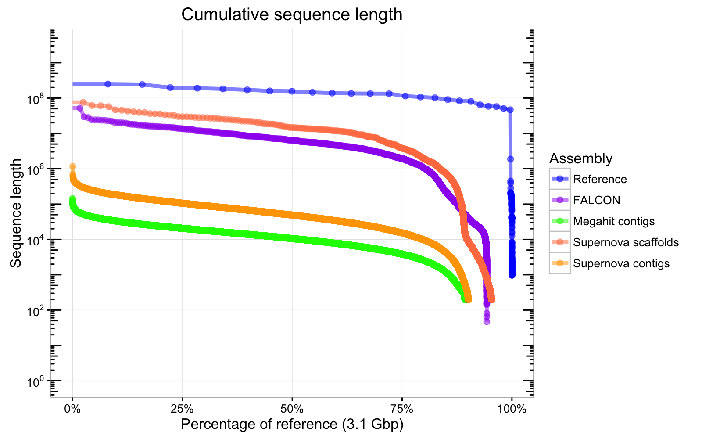

# N-chart




Directions:

1. Install fastalengths by running `chmod +x fastalengths` and adding it to a bin in your path, such as /usr/local/bin/

2. Run fastalengths on each of your assemblies and your reference genome:
	```
	fastalengths my_assembly.fasta > my_assembly.fasta.lengths
	```
	Or with a quick loop in bash:
	```
	for f in *.fa; do fastalengths $f > $f.lengths; done
	```

3. Edit the first few lines of Nchart_script.R with your filenames (the .lengths files) and nicknames for the assemblies you wish to compare, then run it. 


